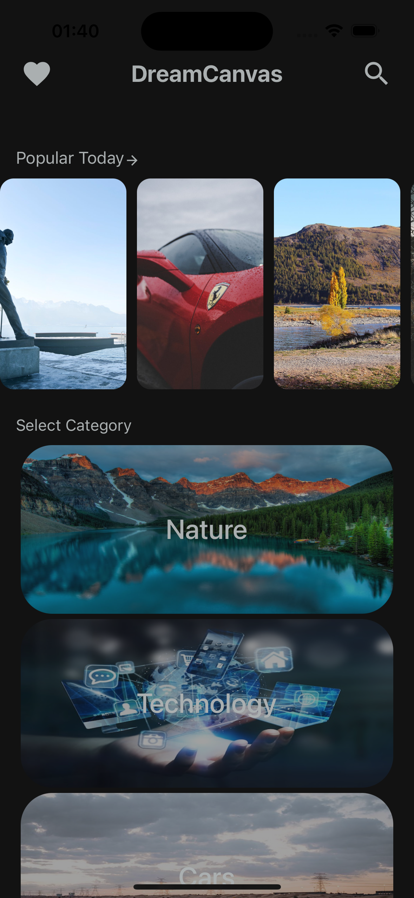
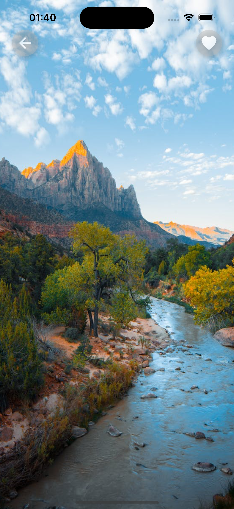
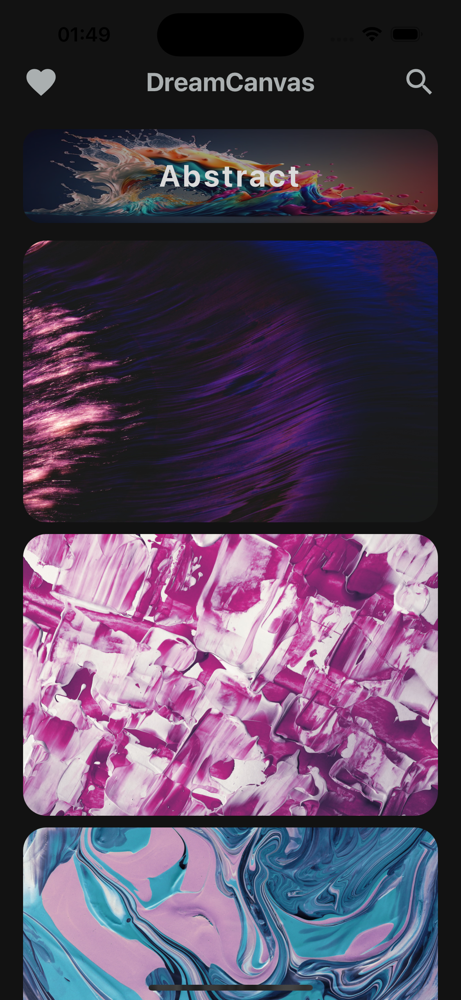

# DreamCanvas

DreamCanvas is an immersive wallpaper app that transforms your device into a canvas of dreams. Unleash your creativity and personalize your surroundings with a stunning collection of high-quality wallpapers. Dive into a world where every glance at your screen becomes a visual delight.

## Screenshots

### Home Screen

*Description: The main screen of DreamCanvas, showcasing the beautiful popular wallpapers, and some incredible categories.*

### Wallpaper Preview

  
  

*Description: Previewing a selected wallpaper before setting it as the device background.*

### Categories

*Description: Explore a variety of images according to the category your interested in.*

## Features

- **Vast Collection:** Explore an extensive library of breathtaking wallpapers carefully curated to suit every mood and style.

- **Infinite Scroll:** Endless possibilities await as you seamlessly scroll through a never-ending canvas of stunning images.

- **Categories Galore:** Whether you're into nature, abstract art, or minimalism, DreamCanvas has a category to match your unique taste.

- **Dynamic Updates:** Regularly updated with new additions, ensuring your canvas is always fresh and inspiring.

- **Easy Navigation:** User-friendly interface with a sidebar for quick category access and a top bar for seamless navigation.

- **Dreamy Preview:** Preview wallpapers in a dreamlike setting before setting them as your device background.

## To-do
- [ ] Set as Wallpaper funtionality